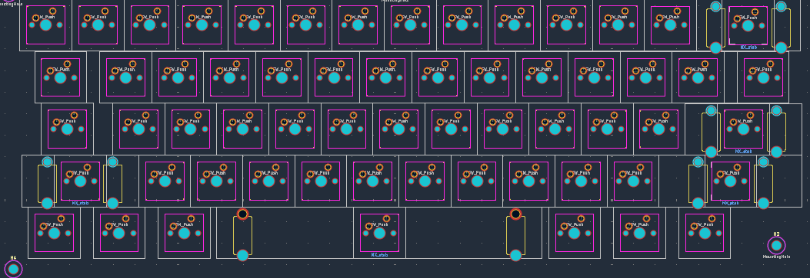
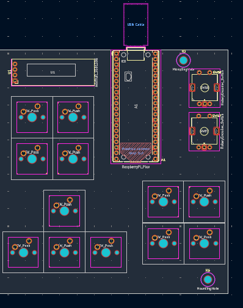

# Finalised layout for my Keyboard !!

.png)

## What I Have

- A standard 5 row keyboard:
    - Top row: Esc, 1-0, -, + and Back
    - Second: Tab, QWERTYUIOP, [], \
    - Third: Caps, ASDFGHJKL, ;, ' and Enter
    - Fourth: LShift, ZXCVBNM, ,(The button) , . , /, RShift 
    - Last row: LCtrl, Win, Alt, Spacebar,Alt, Fn, RCtrl 

- The arrow cluster

- Two Four key cluster ( 2x2 squares ):
    - First one: PgUp, PgDown, Del, `
    - Second one: My four key macropad as i planned

- Two Rotary Encoders:
    - One for volume control
    - One for zooming in and out

- Oled Display

- Mounting holes where i felt appropriate

- The Pi with its usb hanging free

##### Im quite happy with this layout and hope its final !!

## Next Step

- Add diodes
- Wire it up ( Gonna be a nightmare cause of how ive placed my switches )
- The designing the case

THats all for now. thanks for the read !!