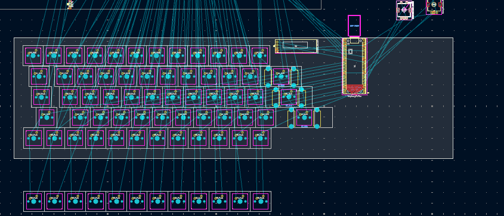

# Actually designing the layout
**Time:** *3 hours*

I know its not yet done, but this is all i could manage today. 

## pHoto

This is the layout i have come up with. the main issue right now is that i cant accomodate many symbols i regularly use, such as ", : etc. 
 
Maybe ill just add a cluster on the right where the space is empty, along with my macropad. 

## Challenges

This actually has a list here:
- The key sizes are so weird, like 2.25 u 😭😭😭😭. And so weird that i had to use a calculator
- Then the keycap set i had to choose so that i can actually choose the key set
- After this, setting the sizes, its not that hard. i found out about the `Shift + M` keyboard shortcut, so i could translate by x asix easily

### What's next

- I think imm going to make a few changes before i finalise the layout
 
- definitely want to add a small cluster on the right for the symbols im missing.
 
- ill probably add the macro cluster there only too
 
- Once im happy with the layout, ill move on to routing everything.
 
- Hopefully that part is less painful than figuring out keycap sizes :)
 

### Thats all for it. thanks a lot !!