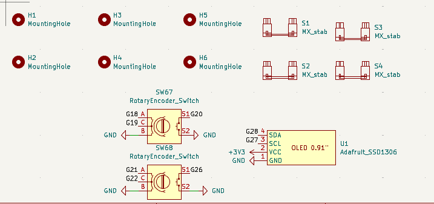
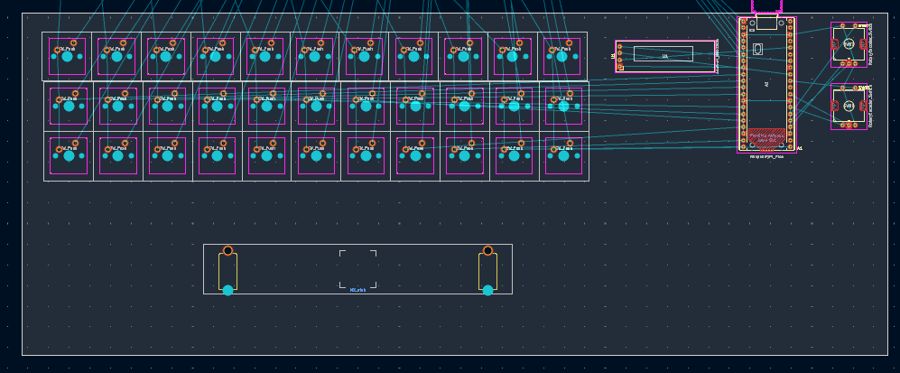

# Adding footprints and starting layout
**Time:** *2 hours*

Yes, it did take a lot of time. mainly cause i had a change of plans. I have now decided to include two rotary encoders and an oled display to my Keyboard !!!
 

## What i did

I added all footprints, ran ERC and fixed all inconsistencies, and then started layout

## The hard part

Probably the hardest was finding the symbol, footprint and 3d model for the oled, but it thankfully worked out yay

  

Ive started making the layout for the keyboard, but im still confused as to where the diodes go

Thats about it... Thanks a lot for the read !!