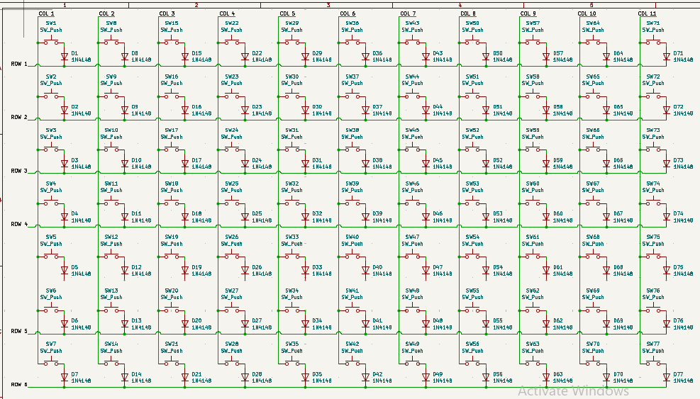
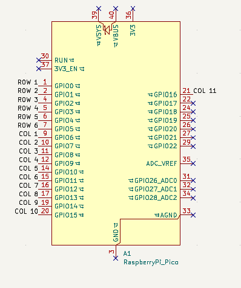

# Making the matrix
**Time:** *15 minutes*

I do have quite a bit of experience with making PCB's. and thankfully the matrix was mostly copy pasting. 

Connected every switch into a 6x11 matrix with diodes and net labels. also sharing raspberry pi image below

