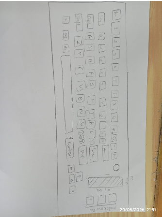

# First time for everything :)

This is my first time making a mechanical keyboard. So Ive decided to go for a 65% exploded layout, because I feel it's not too large and manageable, while still being spacious.

## The Stack

Just the standard:

- All letters, numbers, and that
- Arrow keys
- A dedicated 3 key macropad that I can use as I wish by flashing the code
- A rotary encoder to increase and decrease volume easily
- **NO RGB**
- Idk the color scheme yet
- Probably a 3D-printed case

And of course, the Raspberry Pi Pico as the brain hehe.

## Sketch

Im gonna sketch an initial design.

(For anyone reading, excuse my drawing)

Just trust the vision guys. The CAD's gonna look great.