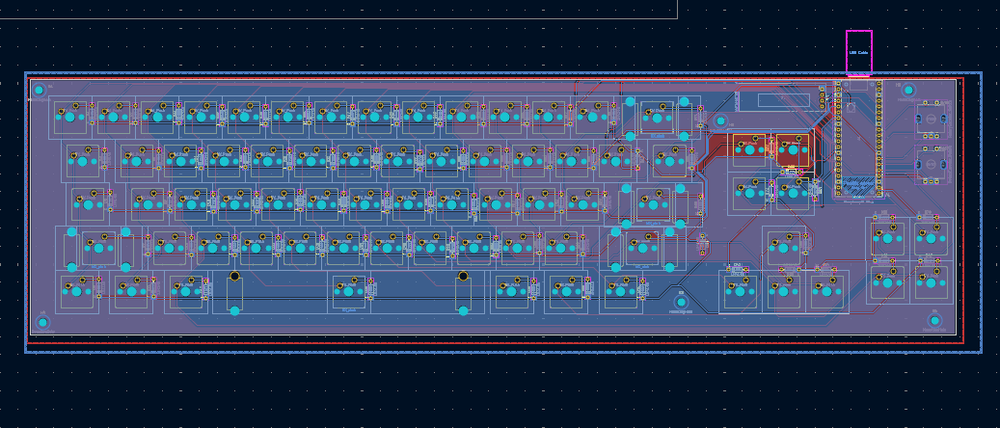
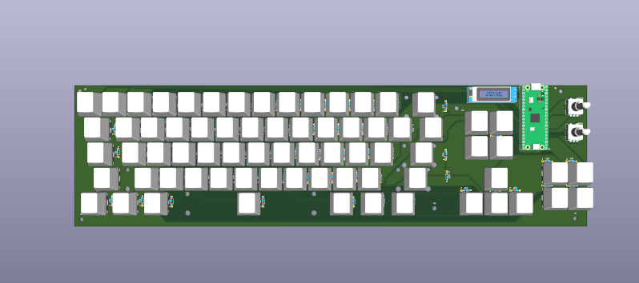
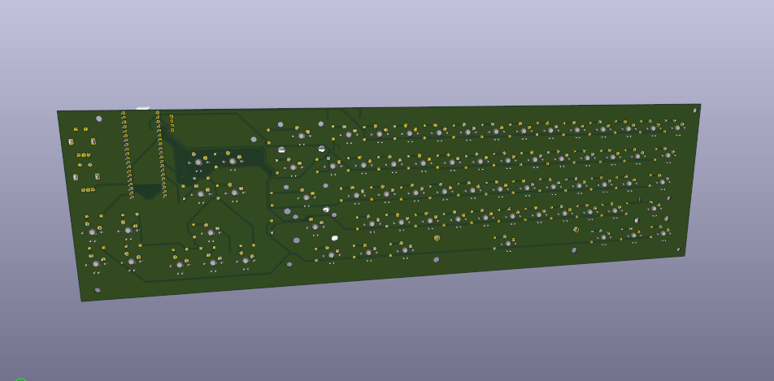

# Its been quite a while

Hello again ! Exam season meant that i had to put a pause on keeb, but now that im back, i still got 4 days to make this work.. yuayy !

## The PCB

Its completed, with 3d models and everything. it was really really hard, especially finding the 3d models
  
Heres a breakdown of waht i did:
- Arranged diodes
- Made the entire ratsnest(made an actual ratsnest of it, it look shorrible)
- Fille dall zones
- FOund switches and keycaps
- made a custom footprint just so that i could actually apply the 3d model to each key
- I did not have the strength to add the stab 3d mdoels

### Pics

   

   

   

   

## Next

Not a lot is left now

- Making the cad
- Writing the bom
- Making more journls
- Submittintg !!

(And hopefully not getting rejected)

### Thanks for the read !